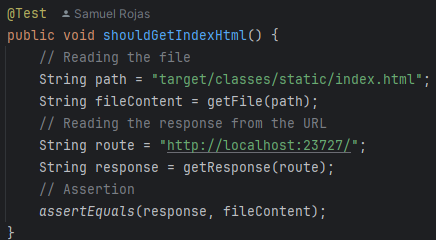

# Modularization and Virtualization of a Concurrent Web Server

This project implements a framework designed to serve HTML pages and PNG images. It also offers an Inversion of Control 
(IoC) framework for building web applications from POJOs (Plain Old Java Objects). Additionally, it provides developer 
tools to define REST services with custom annotations, manage query parameters within requests, specify the location of 
static files for the server and includes a small web application for planning daily activities. Now the server 
receives multiple simultaneous requests by implementing a thread pool that manages clients and a graceful shutdown
method to finish the server properly. 

## Getting Started

### Prerequisites

### 1. **Java Development Kit (JDK)**

- To check if Java is installed, run:

```
java -version
```

- If Java is not installed, download it from the official Oracle [website](https://www.oracle.com/co/java/technologies/downloads/).

### 2. **Maven**

- To check if Maven is installed, run:

```
mvn --version
```

- If Maven is not installed, download it from the official Apache Maven [website](https://maven.apache.org/download.cgi).

### 3. Git

- To check if Git is installed, run:

```
git --version
```

- If Git is not installed, download it from the official Git [website](https://git-scm.com/downloads).

### Installing

1. Clone the repository to your local machine using Git.

```
git clone https://github.com/SamuRoj/AREP_Taller_4.git
```

2. Navigate to the project directory.

```
cd AREP_Taller_4
```

3. Build the project by running the following command:

```
mvn clean install
```

4. Execute the project with the following command:

```
java -cp target/taller-4-1.0-SNAPSHOT.jar edu.escuelaing.arep.WebApplication
```

5. Once the server is running, open your web browser and visit:

```
http://localhost:23727/
```

## Features of the application

- **Annotations:**

  - **GetMapping, PostMapping, DeleteMapping:** Loads a method into the services that will be offered in and 
  clarifies the HTTP method used in the request.
    - value: Defines the route of the endpoint. 

  - **RequestParam:** It's an annotation made for the parameters and contains two values:
    - value: The name of the parameter to be retrieved from the request.
    - defaultValue: The value assigned to the parameter in the method if it is not present in the request. 

  - **RestController:** This annotation enables reading files from disk and automatically loads all methods annotated 
  with any HTTP annotations, making them available as services.

- **Static files endpoint:** Allows developers to define the folder where the files would be queried, this
method can be requested through the following URL with the parameter folder `http://localhost:23727/app/folder?folder=<folder-name>`.

  - By default, this method has the route `static` defined and every request made will be searched within this
    folder

    

  - The folder can be changed to newFolder, which contains a basic HTML file. To verify the change, a request 
  has to be made to the following URL: `http://localhost:23727/app/folder?folder=newFolder`.

    
  
    

  - **Note:** The REST services defined within the controllers will continue to be available.

- **Query for static files** located in the defined folder, to do this just add to the route of the page the name
  of the file like `http://localhost:23727/<filename>`, it can be made with any file that's located in the
  current folder.

  

- **The main page contains a small app** that allows the user to add his daily activities through requests methods
  like GET, POST and DELETE, it's made with HTML, CSS and JavaScript to make asynchronous petitions to the server
  and add new activities to it, all the services mentioned before are found in the ApiController.java file through a
  REST service.

  

- **Concurrent Requests:** Allows simultaneous petitions through the creation of a ThreadPool to manage the requests
of the clients by creating client handlers and submitting them to the pool to answer their request.

   

  

- **Graceful Shutdown:** Every time the server receives a kill signal, it finishes properly by terminating the 
ThreadPool and closing the server socket.

  

## Architecture

### Components Diagram

  

### Components

- **HTML:** It is served through the HTTP server and allows the browser to render the web page.
- **CSS:** It is also served from the server and is responsible for styling the page.
- **JS:** It is served from the server and handles GET, POST, and DELETE requests to refresh the activity list
  on the page, while also keeping the server updated on any changes made.
- **HTTP Server:** It is responsible for serving the files requested by the client, processes the GET, POST,
  and DELETE requests it receives, changes the directory of the file and saves the REST services that has been
  added by the developer.
- **Web Application:** Works as a middleware to connect the HTTP Server and the client, it also defines some
  REST services, loads the components (Controllers) and the route where the files will be searched.

### Project Structure

```
├───main
│   ├───java
│   │   └───edu
│   │       └───escuelaing
│   │           └───arep
│   │               │   WebApplication.java # Class that configures controllers and environment variables for the HttpServer
│   │               │
│   │               ├───annotations # Custom annotations
│   │               │       DeleteMapping.java
│   │               │       GetMapping.java
│   │               │       PostMapping.java
│   │               │       RequestParam.java
│   │               │       RestController.java
│   │               │
│   │               ├───controller # Controllers that contains the REST services being offered
│   │               │       ApiController.java
│   │               │       MathController.java
│   │               │       ServerController.java
│   │               │
│   │               ├───http 
│   │               │       ClientHandler.java # Thread to recieve clients
│   │               │       HttpRequest.java 
│   │               │       HttpResponse.java
│   │               │       HttpServer.java # Main server class
│   │               │
│   │               ├───model
│   │               │       Activity.java # Template for the activities received at the main app
│   │               │       Pair.java
│   │               │
│   │               └───threads
│   │                       ClientThread.java # Thread used for tests
│   │
│   └───resources
│       ├───img # Images used in the README
│       │
│       ├───newFolder # Example folder for the functionality of the static files endpoint
│       │       index.html
│       │
│       ├───static # Static files for the webpage
│       │       index.html
│       │       script.js
│       │       styles.css
│       │       wallpaper.jpeg
│       │
│       └───vid
│               DockerAWSDemo.gif
│               LocalDockerTest.gif              
│
└───test
  └───java
    └───edu
      └───escuelaing
        └───arep # Test files
          HttpRequestTest.java
          HttpResponseTest.java
          HttpServerTest.java
          WebApplicationTest.java
```

## Docker and AWS Deployment

### Local Deployment

1. First from the root of the project execute the following command to create a new Docker image of the project.
An image named `webserver` will be created from the instructions of the file named Dockerfile. 

```
docker build --tag webserver .
```


2. It can be tested locally by creating the previous image and running the following command to create a container of
the application

```
docker run -d -p 23727:6000 --name webservertest webserver
```


3. Now the application could be accessed through this link in a browser: 

```
http://localhost:23727/
```


### Video of local deployment

Demo that shows the previous steps working in three differente containers. 


### Video with Dockerhub and AWS deployment working

This is a demo that shows the deployment of the image on DockerHub, the virtual machine used in AWS, the creation
of the container and the access to the server through the virtual machine showing all the features included in the 
web application. 


## Running the tests

- Execute them by running the following command:

```
mvn test
```

### HttpRequestTest

The tests in this file check the functionality of the method getValues() implemented in the class.

- Example of test:

  

- Image of the results:

  

### HttpResponseTest

The tests in this file check the functionality of the method parseValues() implemented in the class.

- Example of test:

  

- Image of the results:

  

### HttpServerTest

The tests in this file just verifies if the mime type of the file being queried it's the proper one and returns
a valid or invalid answer in case it doesn't exist.

- Example of test:

  

- Image of the results:

  

### WebApplicationTest

The tests in this file runs the application as a thread to check its connectivity and answers to different
requests for a file like index.html, script.js, styles.css and wallpaper.jpeg. It also verifies the functionality of
the REST services defined within the controllers with custom annotations by querying endpoints like `/app/hello`, 
`/app/pi`, `/app/e`, `/app/greeting?name=Samuel`, etc.

- Example of request for a file:

    - Starts and finish the server before and after the execution of all tests.

      

- Finds the file locally and makes a query to the server to compare the responses.

  

- Example of request for a REST service defined within the controllers:

    - It makes a request to an endpoint and asserts the answer it's the same as the one already defined.

      

- Example of multiple petitions to the application through threads and a consistent answer as a result:

  

- Image of the results:

  

## Built With

* [Java Development Kit](https://www.oracle.com/co/java/technologies/downloads/) - Software Toolkit
* [Maven](https://maven.apache.org/) - Dependency Management
* [Docker](https://www.docker.com/) - Platform for building, running, and managing containerized applications
* [AWS](https://aws.amazon.com/es/) - Cloud computing platform for hosting, storage, and computing services
* [Git](https://git-scm.com/) - Distributed Version Control System

## Authors

* **Samuel Rojas** - [SamuRoj](https://github.com/SamuRoj)

## License

This project is licensed under the GNU License - see the [LICENSE.txt](LICENSE.txt) file for details.